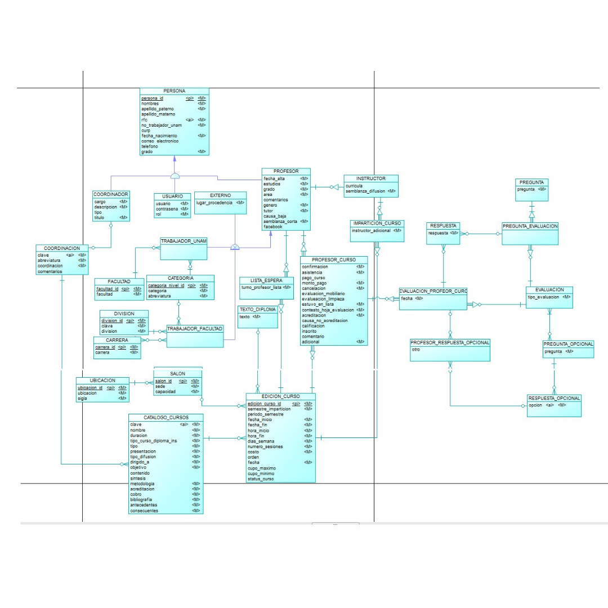

# Proyecto Ehecatl

Aplicación web basada en Flask diseñada para realizar la administración de los cursos virtuales destinados a la comunidad sorda de México, de entre los cuáles de momento se encuentran LSM, español escrito y español hablado.

Credit where credit is due, esta aplicación no habría sido remotamente posible sin el apoyo del [Flask Mega-Tutorial series](https://blog.miguelgrinberg.com/post/the-flask-mega-tutorial-part-i-hello-world) de Miguel Grinberg

#### Beneficios de usar Flask
- Despacho de solicitudes RESTful.
- Utiliza un motor de plantillas Ninja2.
- Soporte para cookies seguras (sesiones del lado del cliente).
- Amplia documentación.
- Compatibilidad del motor de aplicaciones de Google.
- Las API tienen una forma agradable y son coherentes
- Fácilmente implementable en producción
- Mayor compatibilidad con las últimas tecnologías
- Experimentación técnica
- Más fácil de usar para casos simples
- El tamaño de la base de código es relativamente más pequeño
- Alta escalabilidad para aplicaciones simples,
- Fácil de construir un prototipo rápido
- Enrutar la URL es fácil
- Aplicaciones fáciles de desarrollar y mantener
- La integración de la base de datos es fácil
- Núcleo pequeño y fácilmente extensible
- Plataforma mínima pero potente
- Muchos recursos disponibles en línea, especialmente en GitHub

#### Estructura del Proyecto
- /Mulan - Directorio principal. Pero eso ya lo sabían.
    - /app - Contiene toda la magía de back end que se desglozará a continuación
        - /app/__init__.py Aparte de permitir entender a app como un paquete, importamos muchas dependencias y definimos muchas variables de utilidad aquí
        - /app/errors.py A nadie le gustan los errores. Pero cuando llegan, este archivo nos permite tratar con ellos y renderizar páginas personalizadas de error 
        - /app/templates - Las plantillas usadas por Flask para renderizar las páginas web. Todas heredan de base.html gracias a magia de Jira
        - /app/forms.py - Permite definir los formularios usados para ciertas tareas como login, registro, creación de empresas, actualizaión de usuarios, actualización de empresas. Y lo mejor es que si son bien definidos es posible renderizarlos automatizamente gracias a lamagia de WTForms. Pretty nifty stuff
        - /app/models.py Se definen los modelos que queremos usar para la base de datos. Flask tiene una forma un tanto peculiar de lidiar con las relaciones entre modelos. Es mejor entrar con cautela
        - /app/routes.py Aquí pasa casi todo. Modelos y Formularios se unen, así como el enrutamiento y validaciones. 
    - /migrations - Directorio que permite ejecutar las migraciones en la base de datos. Pudiese ser omitida ya que Flask puede reconstruirla gracias al archivo models.py, pero preferí evitarles las molestias
        - .flaskenv Se definen variables de entorno útiles para Flask que se instancían al correr la aplicación
        - config.py La configuración de la DB se establece aquí
        - handler.py EL núcleo del proyecto. Aunque irónicamente realmente no hace nada de importancia. Pero Flask lo necesita para tener un punto de partida.
        - requirements.txt Archivo que incluye el listado de las dependencias de Python usadas y sus versiones. Debe instalarse de preferencia en un entorno virtual pero hey, no soy nadie para obligarlos
        - tests.py Tests que pueden ser ejecutados directamente por la terminal

### Estructura de la BD


### Deployeo local

Lo primero que se debe hacer es clonar el siguente repositorio. Asumiendo que ya está clonado, ingresamos a la carpeta, inicializamos un entorno virtual e instalamos todo lo especificado en requirements
```
$ cd ehecatl
$ python3 -m venv venv
$ source venv/bin/activate
(venv) $ pip install -r requirements.txt
```

Lo que sigue ahora es definir la base de datos. Para ello se supone que las credenciales/configuraciones ya están insertadas en config.py. El siguiente comando inicializará el directorio de migraciones (en caso de no existir. En caso de existir se puede obviar este paso)
```
flask db init
```

Lo que sigue es registrar cambios en los modelos. Recordar que estos son definidos en /app/models.py. Para ello se usa el siguiente comando
```
flask db migrate -m <mensaje opcional>
```

Esto en escencia creará los archivos de migración haciendo uso de las dependencias `alembic` y `sqlalchemy`. En un mundo ideal ello bastaría, pero desafortunadamente no vivimos en un mundo ideal. Este proceso no es perfecto. Especialmente porque para este proyecto se define un tipo especial de dato llamado GUID que no es soportado nativamente por sqlalchemy. Esa clase está definida en `app.models`. Es posible que los archivos generados por el comando anterior no hallan hecho apropiadamente la referencia a dicho módulo. Si eso llegase a pasar solo basta con agregar las siguientes líneas al final de la cabecera del archivo /migrations/env.py
```
from app.models import GUID
import sqlalchemy as sa
sa.GUID = GUID
```

y en cada archivo de la carpeta `versions` reemplazar cualquier referencia a `app.models` por `sa`

Habiendo hecho eso se puede proceder con la migración con el comando:
```
flask db upgrade
```

Los pasos anteriores se deben ejecutar en cualquier cambio en la BD

Una vez configurado eso se puede inicializar la applicaión de flask con el comando 
```
flask run
```

El cuál correrá el servicio y permitirá que desde cualquier navegador se acceda a él por medio de la dirección `http://localhost:5000/`

Una vez se termina de usar el entorno virtual es posible salir usando el comando:
```
(venv) $ deactivate
```

### Pruebas en la Base de Datos
El servidor de base de datos en común está montado en RDS y es públicamente accesible (No la mejor estrategia de seguridad. Lo admito. Pero para esta etapa de desarrollo y pruebas servirá). Pueden acceder por medio de este comando recordando que la base de datos se llama `flask_database`
```
mysql -h flask-database.cekr24jx0ek8.us-east-1.rds.amazonaws.com -P 3306 -u admin -p
```

La contraseña es `12QwAsZx`

### Guía de Usuario
La intención del proyecto es que sea lo más intuitivo posible. El siguiente flujo abarca el flujo completo asumiento que no se tiene cuenta alguna
1. El primer paso es ingresar al sistema. No importa a qué URL válida quiera ingresar el usuario que se desprenda de la URL principal https://flask-mulan.herokuapp.com/, si no está loggeado por defecto lo redireccionará a https://flask-mulan.herokuapp.com/login, y al loggearse lo direccionará a la URL a la que quiere acceder. Esto por el valor `next` (ej. https://flask-mulan.herokuapp.com/login?next=%2Findex)

2. En caso de no tener un usuario registrado se puede dar click en Crear cuenta en la ventana anterior, y eso abrirá la siguiente  URL https://flask-mulan.herokuapp.com/register. De momento no se valida la dirección de correo electrónico directamente. Sólo que cumpla el formato válido.

3. Una vez con la cuenta creada se puede volver a la página de login con las credenciales recién creadas, y una vez loggeados, los redireccionará a la siguiente página principal (https://flask-mulan.herokuapp.com/index o https://flask-mulan.herokuapp.com/)

Esta vista está dividida en dos. El formulario que permite registrar las empresas, y el paginador para visualizar las empresas creadas, que de momento está limitado a tres empresas por página
4. Antes de pasar al proceso de generación de empresas es pruedente visualizar el perfil de usuario. Para ello se puede dar click en Perfil, que redireccionará a https://flask-mulan.herokuapp.com/user/prueba. Ahí se actualiza continuamente el valor de "Última conexión". Hay otro valor que configuraremos si oprimimos `Edita tu perfil`

5. Cuando se oprime `Edita tu perfil`, se direcciona a la siguiente URl https://flask-mulan.herokuapp.com/edit_profile que permite añadir un valor a `Acerca de mi`

Una vez editado se puede volver nuevamente a la URL del Perfil y se verán los cambios reflejados
6. De vuelta a la vista principal (https://flask-mulan.herokuapp.com/), cuando se oprime el botón de Borrar se elimina la empresa invocando la URL https://flask-mulan.herokuapp.com/delete_enterprise/\<enterprise>, y se redireccionaría a la página principal. Bastante intuitivo. Cuando se oprime el botón Actualizar, se invoca la URL https://flask-mulan.herokuapp.com/edit_enterprise/\<enterprise> donde <enterprise> es el nombre de la empresa a buscar. 

### Flask Docummentation
[Documentación de Flask](https://flask.palletsprojects.com/en/2.0.x/)

### Tareas pendientes
- Desplegar desde el formualrio de inserción de empresas el uuid a insertar
- Agregar modales al botón de Eliminar para confirmar la elección
- Permitir editar la lista de valores
- Mejorar el front end de la lista de valores